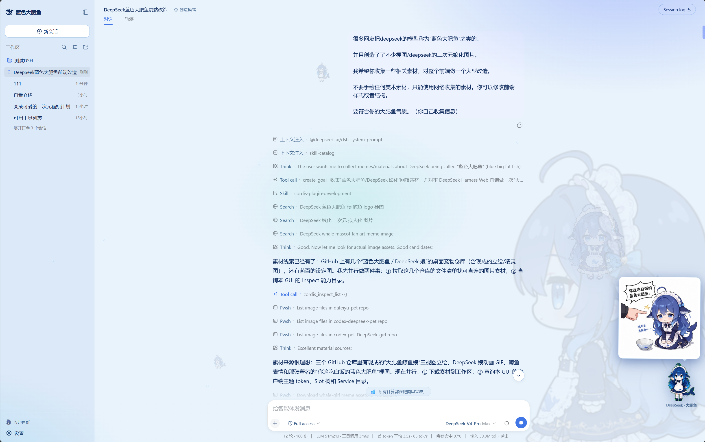

# dafy-whale-theme（蓝色大肥鱼主题）

DeepSeek Harness web 前端的整站主题插件：海洋蓝配色、游动鱼群、上升气泡、右下角 DeepSeek 娘吉祥物（可互动）、输入框上方「每日鱼语」、左上角品牌替换。



## 一句话安装

> 帮我去 https://github.com/DViridescent/dafy-whale-theme 安装大肥鱼插件

把这句话发给你的 DeepSeek Harness，它会自动完成全部安装；完成后按它提示刷新浏览器（F5）即可。

## 手动安装

克隆本仓库到任意位置，然后执行：

```bash
node install.mjs
```

安装脚本自动完成全部工作：复制插件到 profile、写入挂载行、从素材源仓库补齐全部图片、自检校验（幂等，可重复执行）。

如需手动挂载，在 `$DSH_HOME/profiles/web/cordis.patch.yml` 追加：

```yaml
- insert:
    - id: dafy-whale-theme
      name: dafy-whale-theme
```

## 特性

- 海洋蓝亮/暗双主题配色，DeepSeek 蓝品牌色
- 全屏氛围：海面光晕、上升气泡、来回游动的鱼群（侧边栏可开关）
- 右下角 DeepSeek 娘吉祥物：单击招手+随机肥鱼语录，双击弹出梗图，悬停 ✕ 收起
- 输入框上方滚动「每日鱼语」
- 左上角品牌：官方鲸鱼图标 + 「蓝色大肥鱼」字标
- 窄侧栏自适应，无 UI 裁切

## 素材与许可

代码采用 MIT 许可（见 [LICENSE](LICENSE)）。图片素材来自社区仓库，逐文件许可明细见 [NOTICE](NOTICE)：

- MIT 许可素材（鲸鱼娘立绘、肥鱼表情、梗图）随仓库分发
- DeepSeek 娘动图（源仓库无许可声明）由安装脚本在**安装时自动从原仓库获取**，本仓库不直接分发

「DeepSeek 娘」为基于 DeepSeek 品牌角色的二创形象，如计划大规模商业使用请自行评估品牌权利风险。
